# Job 08
- Frontend : http://localhost:5173
- Backend : http://localhost:3000
- Test MySQL : http://localhost:3000/db-test
- phpMyAdmin : http://localhost:8081

  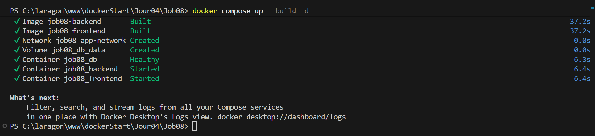

  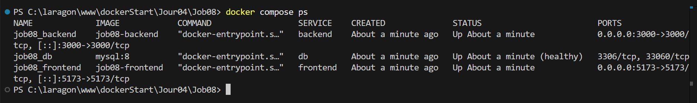

  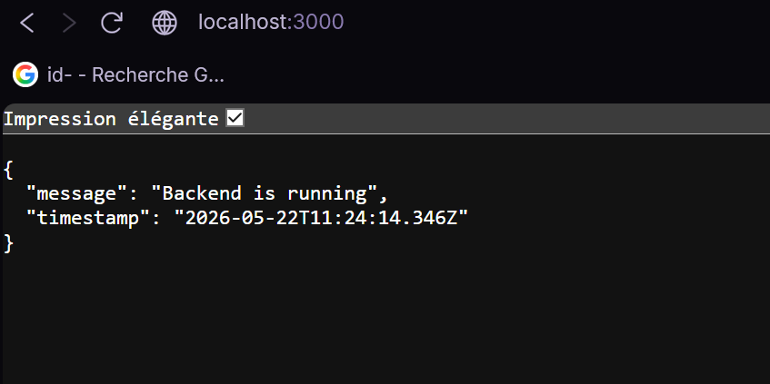

  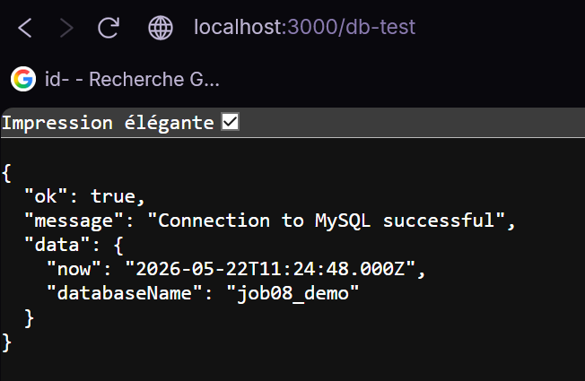

  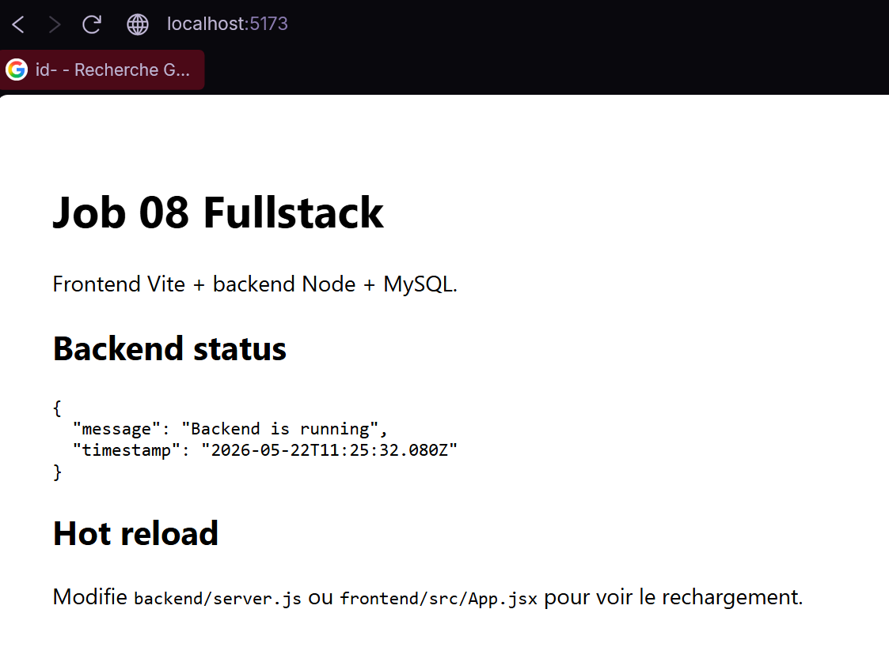

  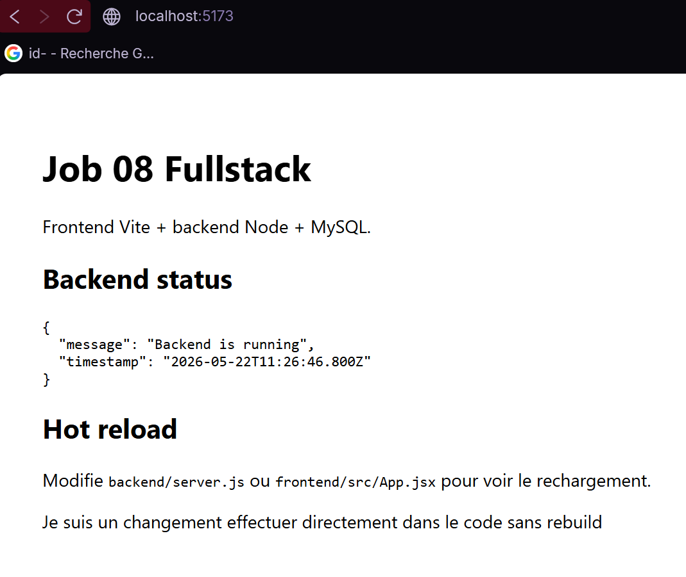

  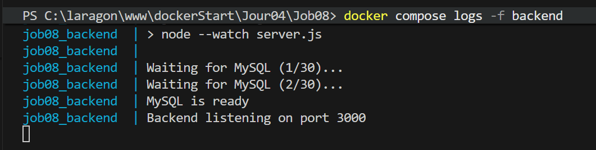

  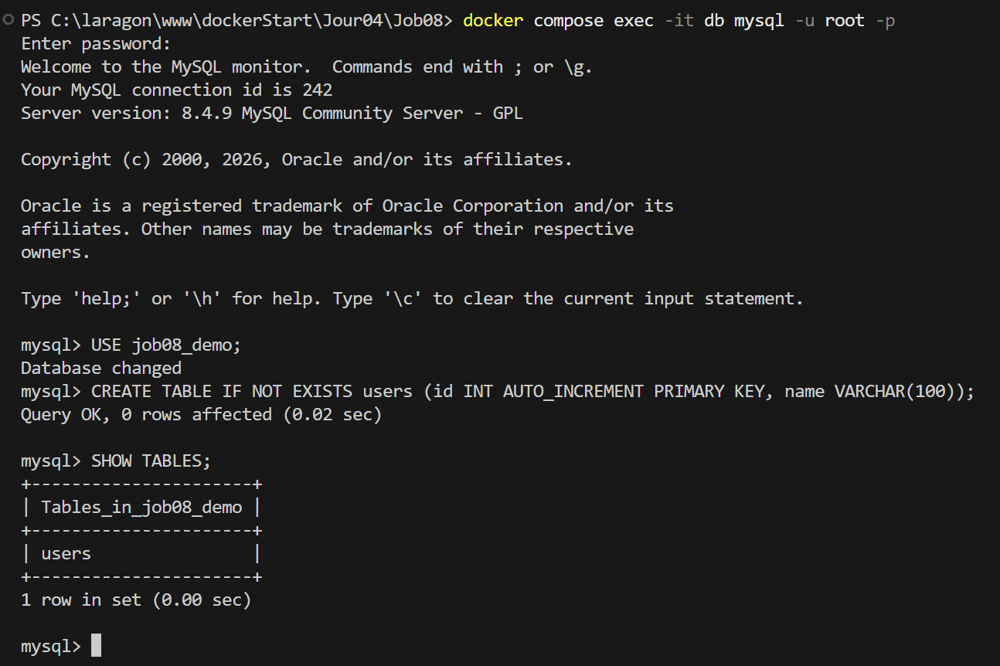

  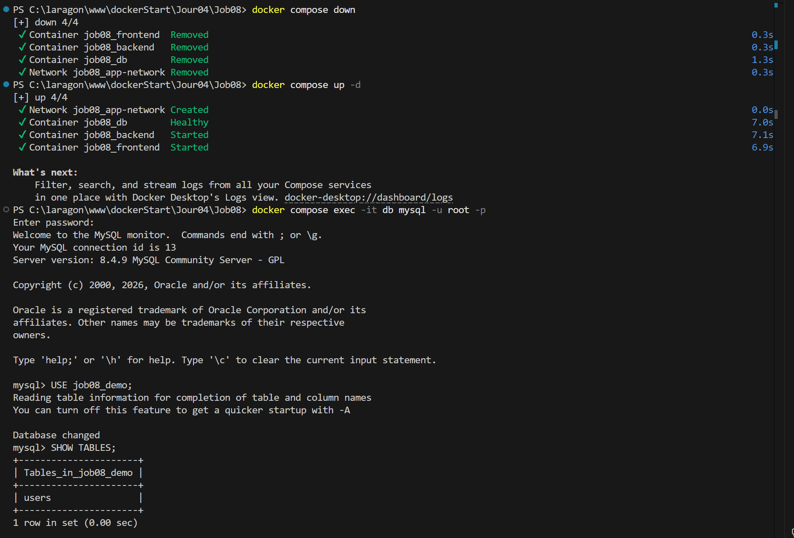

  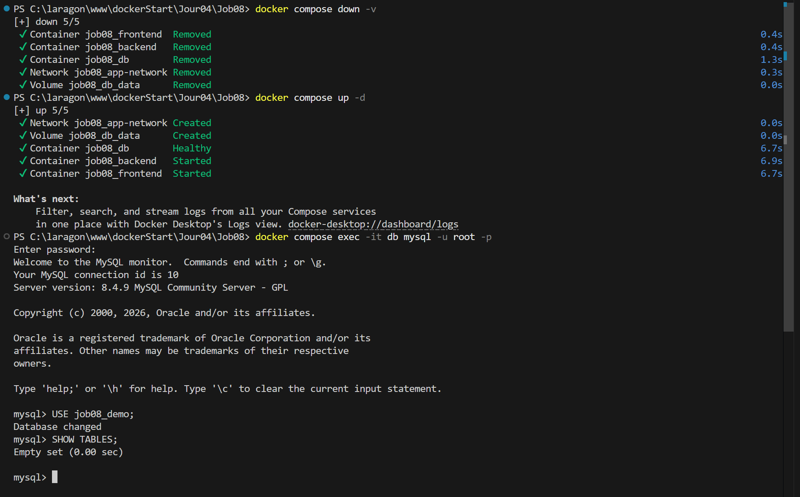

  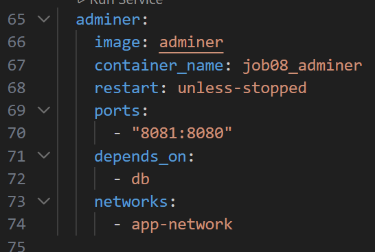

  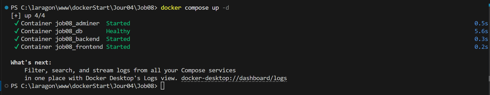

  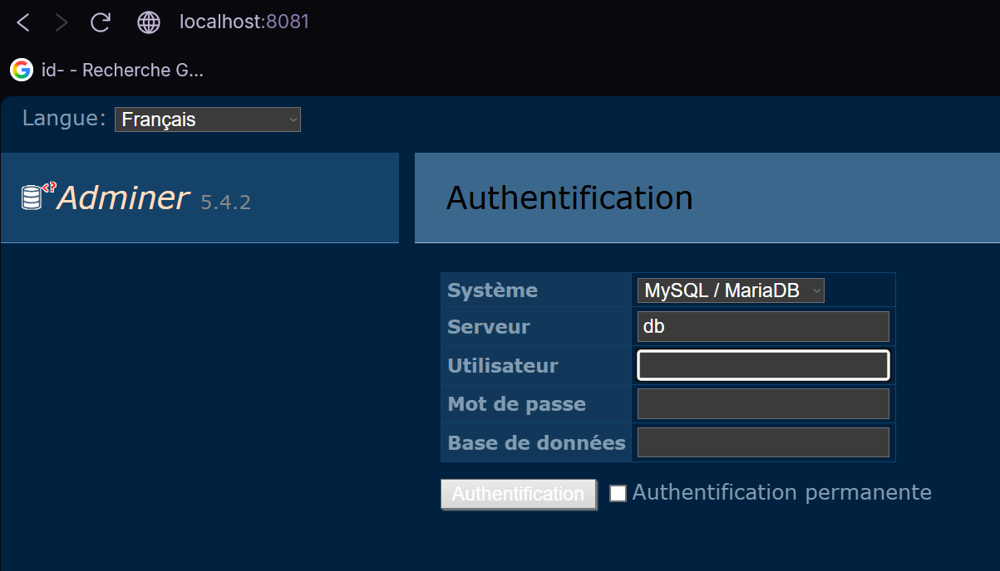

  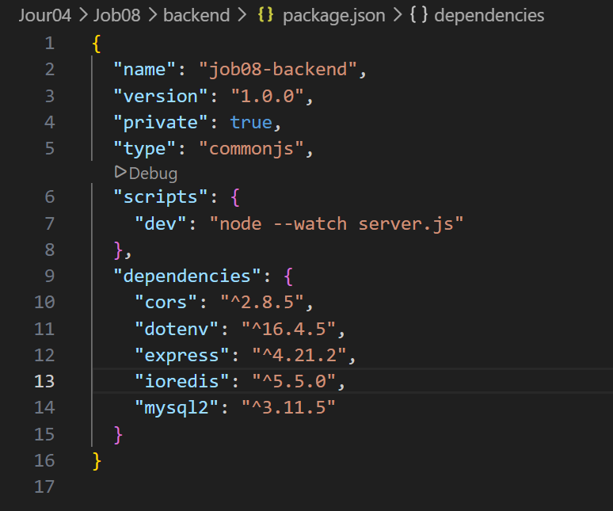

  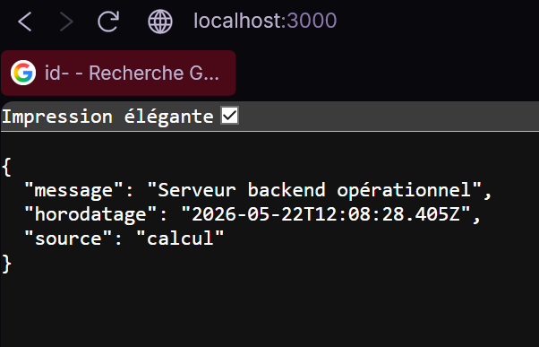

  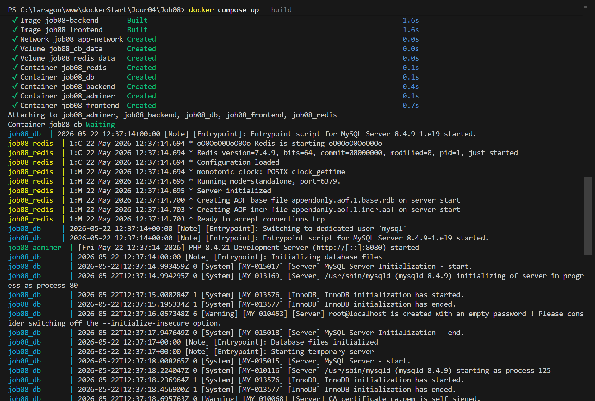

  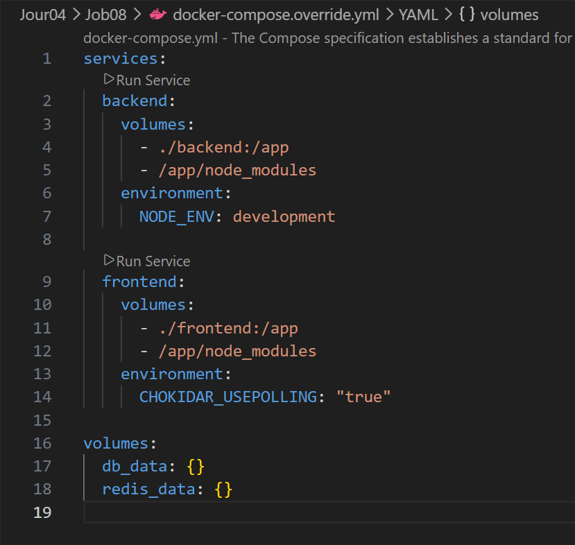

  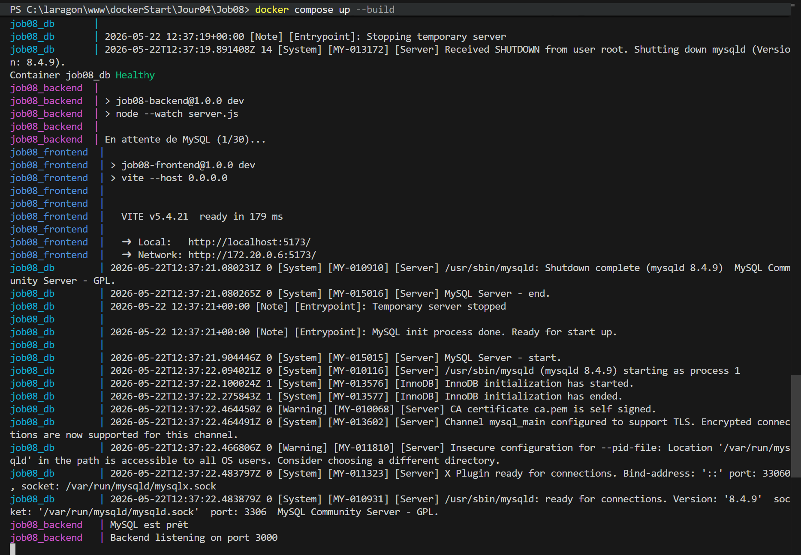

  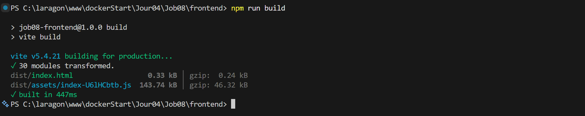

  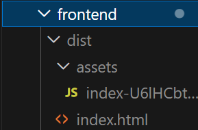

