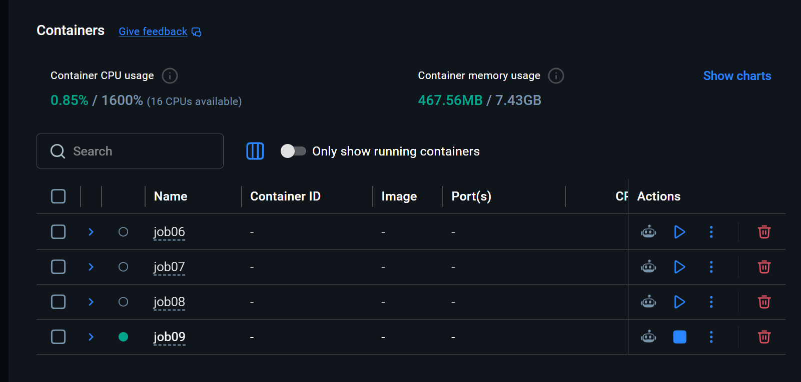
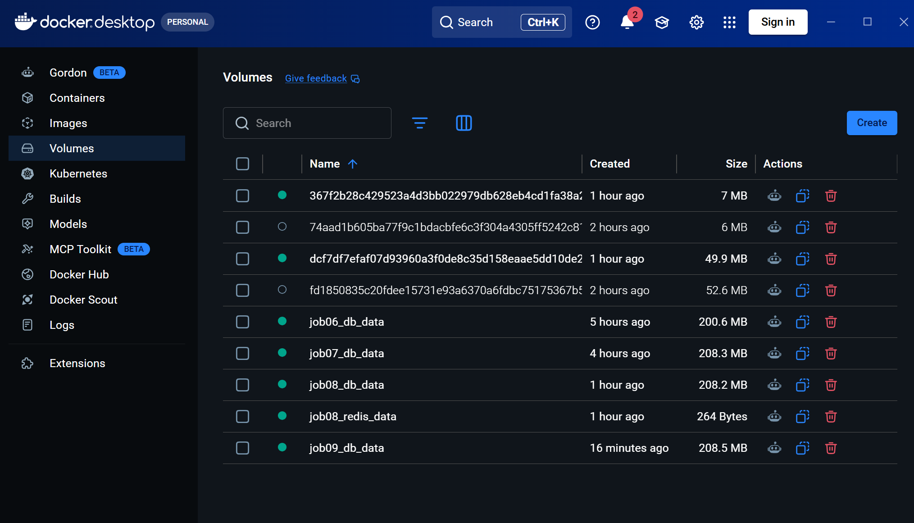
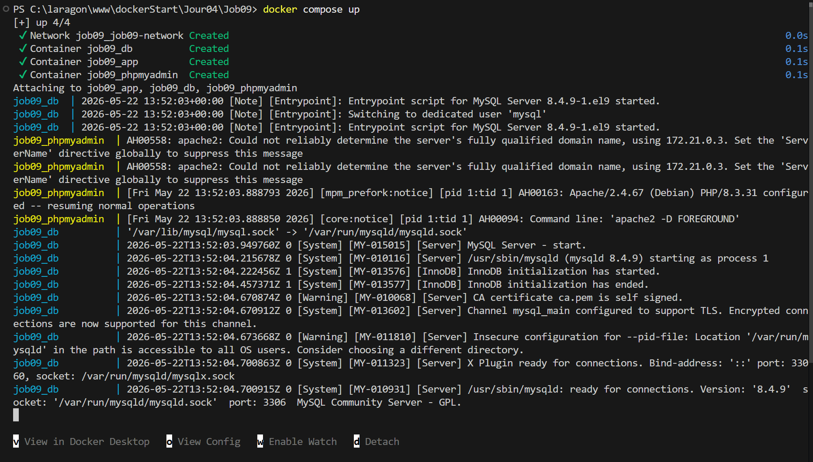
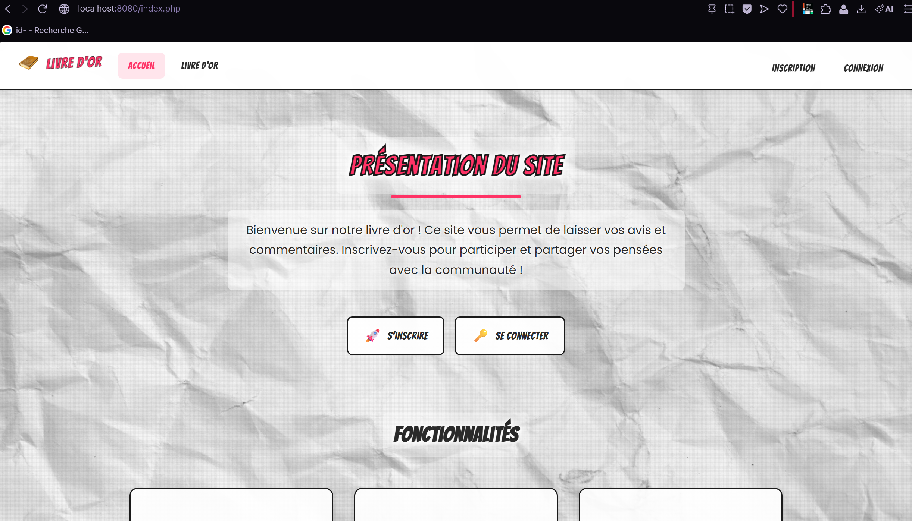

# Job 09 — Dockeriser le projet Livre d'or

## Lancement rapide

### 1. Cloner le dépôt

```powershell
git clone https://github.com/enzo-cys/dockerStart.git
cd dockerStart/Jour04/Job09
```

### 2. Préparer l'environnement

Si le fichier `.env` n'est pas déjà présent, copie le template et le modifier si besoin:

```powershell
Copy-Item .env.example .env -Force
```

### 3. Démarrer la stack (docker compose)

```powershell
docker compose up -d --build
```

### 4. Ouvrir l'application 

- Application : http://localhost:8080
- phpMyAdmin : http://localhost:8081

## Commandes utiles 

Arrêter la stack :

```powershell
docker compose down
```

Réinitialiser complètement la base de données et relancer :

```powershell
docker compose down -v
docker compose up -d --build
```

Voir les logs si quelque chose bloque :

```powershell
docker compose logs -f
```

## Notes utiles

- La base MySQL est initialisée automatiquement avec `db/init.sql` au premier démarrage.
- Les données sont conservées dans le volume nommé `db_data`.
- Si tu modifies le dump SQL, pense à refaire `docker compose down -v` avant de relancer.


<p align="center">
  
</p>

<p align="center">
  
</p>

<p align="center">
  
</p>

<p align="center">
  
</p>
